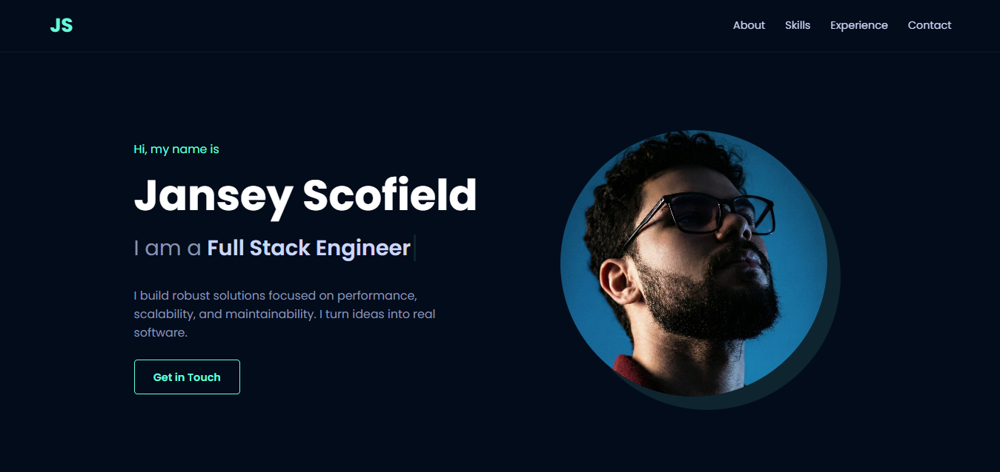

# 🚀 Professional Portfolio | Jansey Scofield


> "I build robust solutions focused on performance, scalability, and maintainability."

A modern, responsive web application developed to showcase my journey, skills, and projects as a Full Stack Developer. This project represents a **complete refactoring** of a static legacy version (HTML/JS) into a component-based architecture using **React**.

---

## 🖼️ Preview



## ✨ Key Features

* **⚡ Reactive Architecture:** Migration from direct DOM manipulation to **React Hooks** (`useState`, `useEffect`).
* **🧩 Componentization:** Modular structure (Header, Hero, Skills, Experience, Footer) ensuring maintainability and scalability.
* **📱 Responsive Design:** Fully adaptive layout for mobile and desktop devices with an interactive hamburger menu.
* **✨ Animations:** Custom "Typewriter" effect and "Scroll Reveal" features implemented via React logic.
* **🎨 Polished UI:** Modern styling using CSS variables, Phosphor Icons, and Devicon.

## 🛠️ Tech Stack

* **Core:** React.js (Vite)
* **Styling:** CSS3 (CSS Modules / Global Styles), Responsive Design
* **Icons:** Phosphor Icons, Devicon
* **Deployment:** Vercel

## 📂 Project Structure

The project was organized to maximize code reusability and separation of concerns:

```bash
src/
├── components/      # Isolated components
│   ├── Experience.jsx
│   ├── Footer.jsx
│   ├── Header.jsx
│   ├── Hero.jsx
│   ├── JobCard.jsx  # Reusable UI component
│   ├── SkillCard.jsx # Reusable UI component
│   └── Skills.jsx
├── App.jsx          # Application orchestrator
├── App.css          # Global styles and variables
└── main.jsx         # Entry point